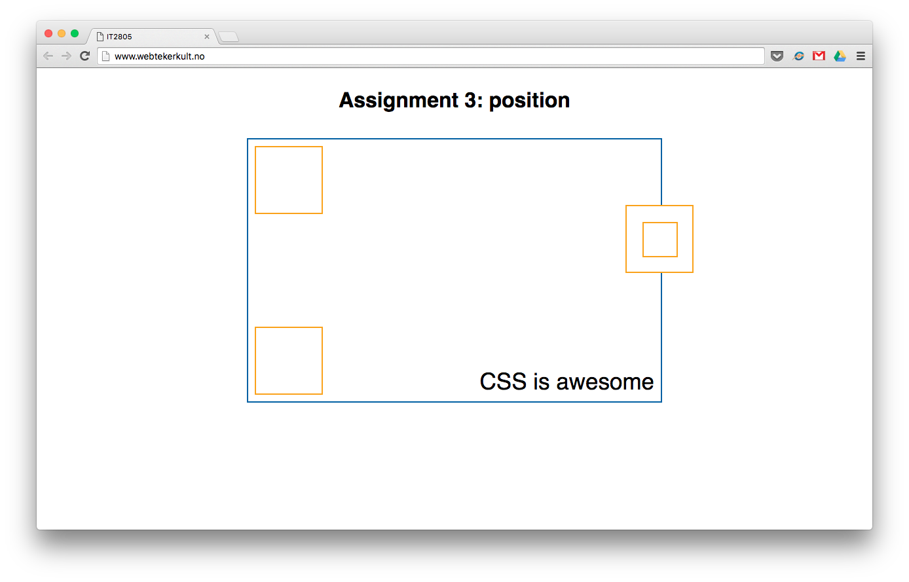

# Assignment 3: CSS continued

In this assignment you will learn a bit more advanced CSS.

## Part 1: Position Attributes (20%)
Download the provided files and open ```position.html```. Use the appropriate position attributes to style the provided file so that it looks like the image below. There is no need to change the HTML, only the CSS in the ```head``` section. Write your code under ```/* Part 1 */```.

The orange boxes must have the same placement, relative to the blue box, at all times, also if the browser window is resized. The blue box' width shall be relative to the browser's width.



Note that the blue box and the heading must at all times be at the center of the browser window.

## Part 2: Styling using pseudo-selectors (20%)
In the provided file `position.html`, make the text "CSS is awesome" into a link that points to [https://developer.mozilla.org/en-US/docs/Web/CSS](https://developer.mozilla.org/en-US/docs/Web/CSS).

We want to decide for ourself how the link must look on hover, and not use the default styles. We do not want to look like everybody else, do we? Write your code under ```/* Part 2 */``` in the ```head``` section. Use the appropriate ```pseudo-selectors``` to style the link. The link shall have a style for when it is unvisited, visited, when the mouse hovers over it, and when it has been selected.

If you want, you are allowed to style the visited and unvisited links similar.

## Part 3: Styling the footer (25%)

Use the provided file `list.html`. Even though our webpage does not have enough content to push the footer to the bottom, we would like it to be at the bottom. "Why?", you might ask. Because it looks silly when it is on the middle of the page.

We have set up the HTML, you have to add the CSS. Add the correct attributes and values so that the footer always is at the bottom of the page. If there is enough content to fill the page, the footer must be pushed below the content, not being visible before the user scrolls down. This

```css
position: fixed;  
bottom: 0px;
```
is not sufficient as this will fix the footer to the bottom of the browser window, ignoring the document flow.

Hint: The wrapper must at least have the same height as the browser window, and the footer must be at the bottom of the wrapper. Test your code by adding some paragraphs with text.

## Part 4: List Styling (25%)
Inside `list.html`, below your header, create an unordered list with the same content as you see below.

* HTML5
* CSS
    * LESS
    * Sass
    * SCSS
* JavaScript
    * React
    * Node
    * Jquery
    * AngularJS
    * Backbone
    * Ember
    * Babel

Use CSS, included as an external stylesheet, to style the list in the following way:
* Change the bullets into squares.
* Use ```pseudo-selectors``` to style the last element of a sublist differently than the other list elements. E.g., 'SCSS' and 'Babel' could have a different font color.  

## Questions (10%)
1. What is the difference between ```position: absolute``` and ```position: fixed```?
2. With CSS3, how do we access the third element within another element?

Deliver the answers as a .txt file together with your other deliverables. 

## Deliverables
Submission should be uploaded as a zip file into It’s Learning before the deadline. Submissions are ONLY accepted via Its Learning. We DON’T accept late assignments. Emails or any other messages with late assignments are automatically discarded without further communication
