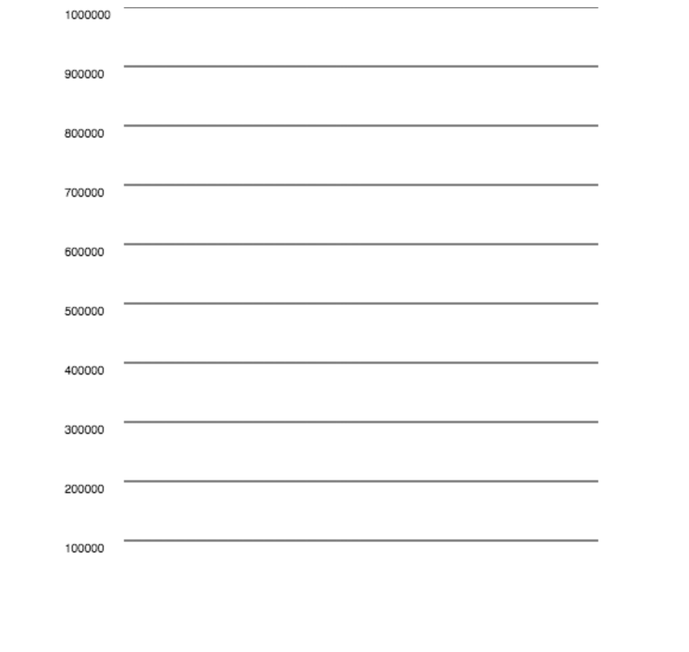
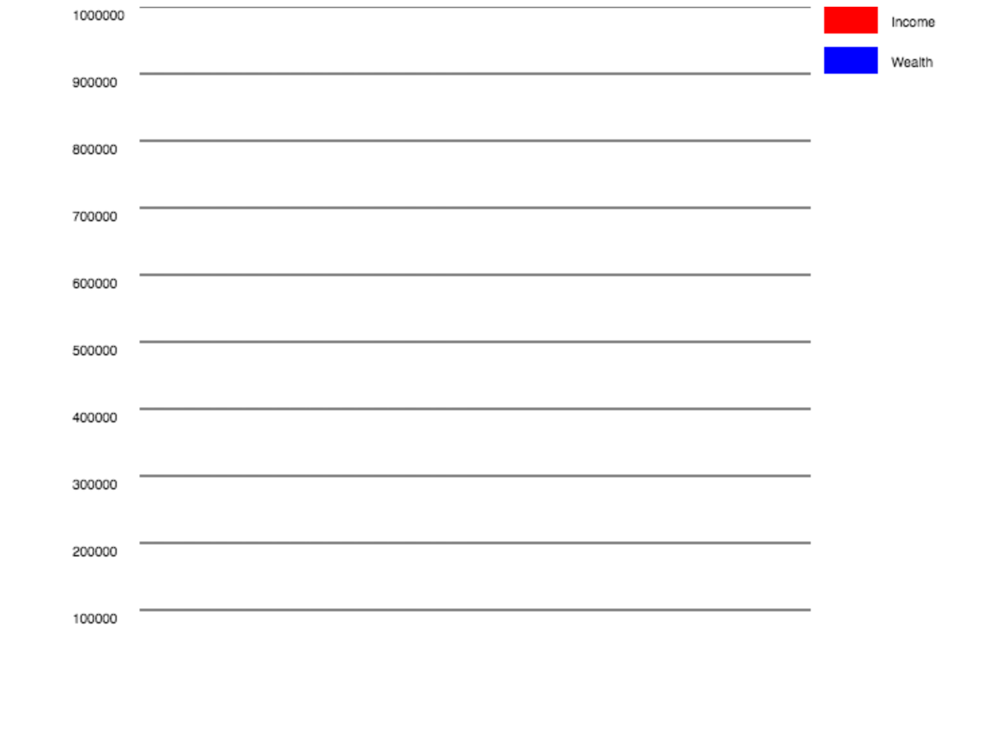
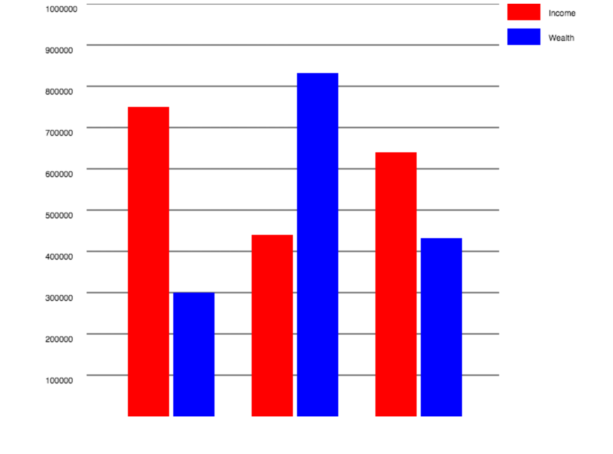

# Assignment 8: Canvas

The Norwegian Tax Administration wants an easy way of visualizing the tax and income of superheros. In this exercise you are going to use the canvas element to create a bar chart from Javascript objects stored on a webserver.

## Part 1: Filter objects in an array (10%)
This exercise will give you a feel for how to iterate over an array of objects in Javascript.

In ````income-greather-than-500k.html```` you will find an array of tax forms assigned to the variable called ````taxForms````.  

In its current state the entire array is logged to the console. You need to change the Javascript such that only the real name of the superheroes that have an income greater than 500 000 are logged with ````console.log````.

## Part 2: Create lines with Canvas (25%)
Although ````console.log```` is practical for debugging, it is not very helpful when you want to visualize data. Luckily HTML5 let's us programmatically generate images directly in the browser. In this exercise you are going to programmatically recreate the image below using the Canvas element and its methods.

The file called ````bar-chart-with-lines.html```` provides you with some convenient functions for drawing lines and text on the canvas.

You do not have to worry about the lines not being *identical* to the image . However, there has to be 10 lines and they need to have the same values on the y-axis as seen in the image.



## Part 3: Create labels with Canvas (25%)

Reuse the code from ````bar-chart-with-lines.html```` and save it as ````bar-chart-with-labels.html````.

In this file you need to create labels for what will ultimately be the colors of the bars. Try to replicate the following image.



## Part 4: Draw bars with Canvas (25%)
Now that it is time to draw the actual bars. Create a new file called ````bar-chart-with-bars.html````. Copy over the code from ````bar-chart-with-labels.html````.

Iterate over the tax forms in the ````taxForms```` variable and draw rectangles so that their height and color correspond to the income and wealth for each superhero.

Note that your code only needs to handle exactly three tax forms at a time.

The end result should look something like this:



## Questions (15%)
1. What other context(s) can we get when calling ````getContext()```` on a Canvas element?
2. How would you create a blue circle using the Canvas element? Explain with words or code.
3. What is a more terse (also known as shorter) way of writing the loop in the following using the ````Array.filter```` method?


````javascript
const countries = ['Norway', 'Sweden',  'Denmark', 'New Zealand'];
const countriesStartingWithN = [];

for (let i = 0; i < countries.length; i++) {
  let country = countries[i];
  if (country.startsWith('N')) {
    countriesStartingWithN.push(country);
  }
}
````

Deliver the answers as a .txt file together with your other deliverables. 

## Deliverables
Submission should be uploaded as a zip file into It’s Learning before the deadline. Submissions are ONLY accepted via Its Learning. We DON’T accept late assignments. Emails or any other messages with late assignments are automatically discarded without further communication.
